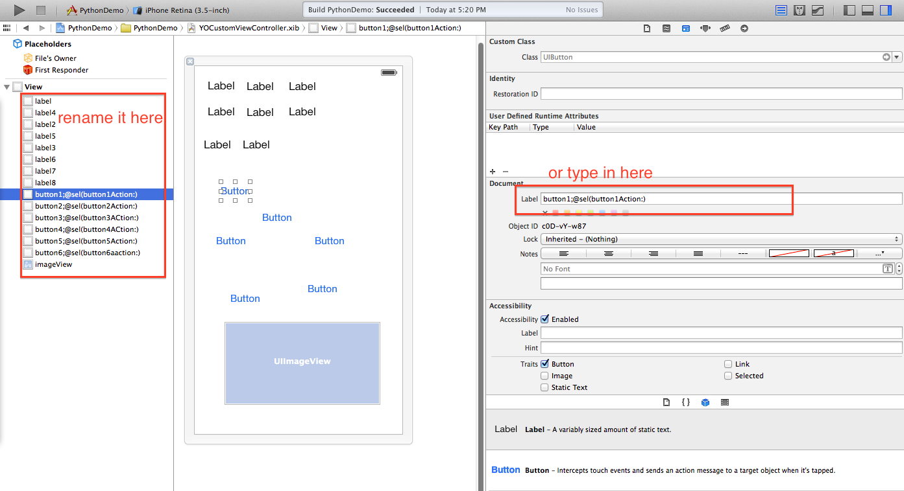

# XibOutletActionGenerator
  XOAG is a python script to generate IBOutlet and IBAction for u.

## Usage:
  python generator.py -a -c xibfile
  
  -a: arc enabled
  
  -c: make a copy of .xib .h .m file when saving

  Fill in the property name and action name in XcodeSpecificLabel field in xcode xib editor with this kind of format `buttonName;@sel(buttonAction:)` or `labelName`.
  
  
